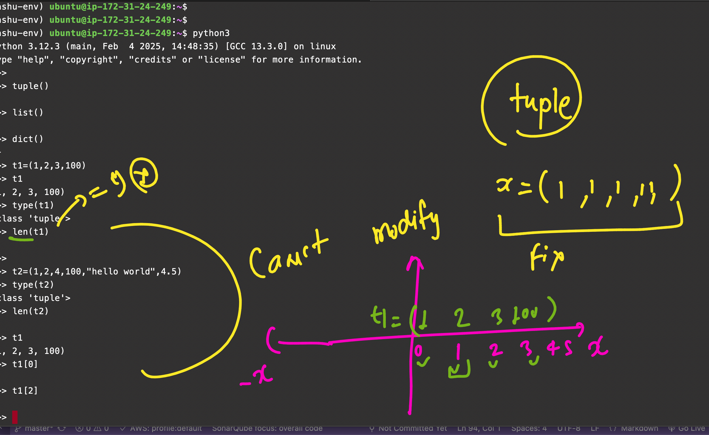

### Cloud -- The need of the day 


### Dask with all possible Compute ENV 


### Making Python ENV ready for Dask 

### Remote Linux Machine -- Connecting with SSH Protocol 

### From PowerShell / Terminal 
```sh
ssh ubuntu@54.172.190.69
```

### Python VENV 


### Checking Python Version 

```sh
ubuntu@ip-172-31-24-249:~$ python3 -V
Python 3.12.3

# Install some extra Python related software 
```

### Creating VENV in Python 

```sh
ubuntu@ip-172-31-24-249:~$ python3 -m venv ashu-env 
ubuntu@ip-172-31-24-249:~$ ls
ashu-env
```

### Activating Python VENV 

```sh
ubuntu@ip-172-31-24-249:~$ source ashu-env/bin/activate
(ashu-env) ubuntu@ip-172-31-24-249:~$ 
```

### Some Basic Data Structures in Python 

```python
(ashu-env) ubuntu@ip-172-31-24-249:~$ python3
Python 3.12.3 (main, Feb  4 2025, 14:48:35) [GCC 13.3.0] on linux
Type "help", "copyright", "credits" or "license" for more information.

>>> tuple()
()
>>> list()
[]
>>> dict()
{}
>>> 

# Creating tuple 
>>> t1 = (1, 2, 3, 100)
>>> t1
(1, 2, 3, 100)
>>> type(t1)
<class 'tuple'>
>>> len(t1)
4

>>> t2 = (1, 2, 4, 100, "hello world", 4.5)
>>> type(t2)
<class 'tuple'>
>>> len(t2)
6

>>> t1
(1, 2, 3, 100)
>>> t1[0]
1
>>> t1[2]
3
```

### Tuple Basic Info 



### Some Basic Info About List 

```python
>>> l1 = [2, 6, 1, 9]
>>> type(l1)
<class 'list'>
>>> l1
[2, 6, 1, 9]

>>> l2 = [2, 66, 11, 99, 5.3, "hello dask"]
>>> len(l2)
6

>>> l1
[2, 6, 1, 9]
>>> l1.append(100)
>>> l1
[2, 6, 1, 9, 100]

>>> l1.insert(0, 878)
>>> l1
[878, 2, 6, 1, 9, 100]
>>> l1.append(t1)
>>> l1
[878, 2, 6, 1, 9, 100, (1, 2, 3, 100)]
```

### Dict in Python 

```python
>>> d1 = {1: "ashu", 9: 100, "hi": 8000}
>>> d1
{1: 'ashu', 9: 100, 'hi': 8000}
>>> d1.keys()
dict_keys([1, 9, 'hi'])
>>> d1.values()
dict_values(['ashu', 100, 8000])

>>> d1[9]
100
>>> d1
{1: 'ashu', 9: 100, 'hi': 8000}
>>> d1[2] = 1000
>>> d1
{1: 'ashu', 9: 100, 'hi': 8000, 2: 1000}
```

### Limitations in Python Data Structure 


### For Big Data Pipeline Transformation Temp Results Also Lead to OOM Error 


### Intro to Python Dask 


Dask is a flexible, open-source library for parallel computing in Python. It is designed to scale Python code from single machines to large clusters, enabling efficient handling of larger-than-memory datasets and parallelizing computations. Dask integrates seamlessly with the Python ecosystem, including libraries like NumPy, pandas, and scikit-learn.

### Installing Numpy in python venv 

```
(ashu-env) ubuntu@ip-172-31-24-249:~$ pip install numpy 
Collecting numpy
  Using cached numpy-2.2.4-cp312-cp312-manylinux_2_17_x86_64.manylinux2014_x86_64.whl.metadata (62 kB)
Using cached numpy-2.2.4-cp312-cp312-manylinux_2_17_x86_64.manylinux2014_x86_64.whl (16.1 MB)
Installing collected packages: numpy
Successfully installed numpy-2.2.4
(ashu-env) ubuntu@ip-172-31-24-249:~$ 

===>
(ashu-env) ubuntu@ip-172-31-24-249:~$ python3
Python 3.12.3 (main, Feb  4 2025, 14:48:35) [GCC 13.3.0] on linux
Type "help", "copyright", "credits" or "license" for more information.
>>> import numpy
>>> numpy.__version__
'2.2.4'
>>> 


>>> import numpy  as np 
>>> import numpy  as ashunp
>>> dir(ashunp)
['False_', 'ScalarType', 'True_', '_CopyMode', '_NoValue', '__NUMPY_SETUP__', '__all__', '__array_api_version__', '__array_namespace_info__', '__builtins__', '__cached__', '__config__', '__dir__', '__doc__', '__expired_attributes__', '__file__', '__former_attrs__', '__future_scalars__', '__getattr__', '__loader__', '__name__', '__numpy_submodules__', '__package__', '__path__', '__spec__', '__version__', '_array_api_info', '_core', '_distributor_init', '_expired_attrs_2_0', '_globals', '_int_extended_msg', '_mat', '_msg', '_pyinstaller_hooks_dir', '_pytesttester', '_specific_msg', '_type_info', '_typing', '_utils', 'abs', 'absolute', 'acos', 'acosh', 'add', 'all', 'allclose', 'amax', 'amin', 'angle', 'any', 'append', 'apply_along_axis', 'apply_over_axes', 'arange', 'arccos', 'arccosh', 'arcsin', 'arcsinh', 'arctan', 'arctan2', 'arctanh', 'argmax', 'argmin', 'argpartition', 'argsort', 'argwhere', 'around', 'array', 'array2string', 'array_equal', 'array_equiv', 'array_repr', 'array_split', 'array_str', 'asany

```

## Some basic examples of data storage using numpy 

```
ashu-env) ubuntu@ip-172-31-24-249:~$ python3
Python 3.12.3 (main, Feb  4 2025, 14:48:35) [GCC 13.3.0] on linux
Type "help", "copyright", "credits" or "license" for more information.
>>> 
>>> import numpy  as np 
>>> 
>>> arr1 = np.array([1,4,6,7,8])
>>> arr1
array([1, 4, 6, 7, 8])
>>> 
>>> np.zeros(10)
array([0., 0., 0., 0., 0., 0., 0., 0., 0., 0.])
>>> np.ones(10)
array([1., 1., 1., 1., 1., 1., 1., 1., 1., 1.])
>>> 
>>> arr2 = np.ones((3,4))
>>> arr2
array([[1., 1., 1., 1.],
       [1., 1., 1., 1.],
       [1., 1., 1., 1.]])
>>> 


```


### Installing dask on single machine 

```
 90  pip install dask 
   91  pip install dask[complete] 
```

### checking dask version 

```
(ashu-env) ubuntu@ip-172-31-24-249:~$ python3
Python 3.12.3 (main, Feb  4 2025, 14:48:35) [GCC 13.3.0] on linux
Type "help", "copyright", "credits" or "license" for more information.
>>> import dask
>>> dask.__version__
'2025.2.0'
>>> 

```

### Understanding spark working for dask 


