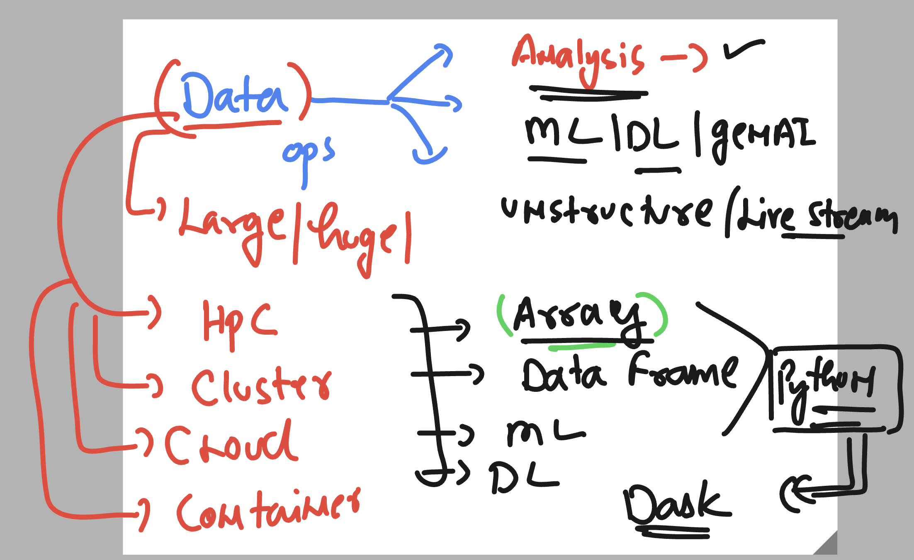
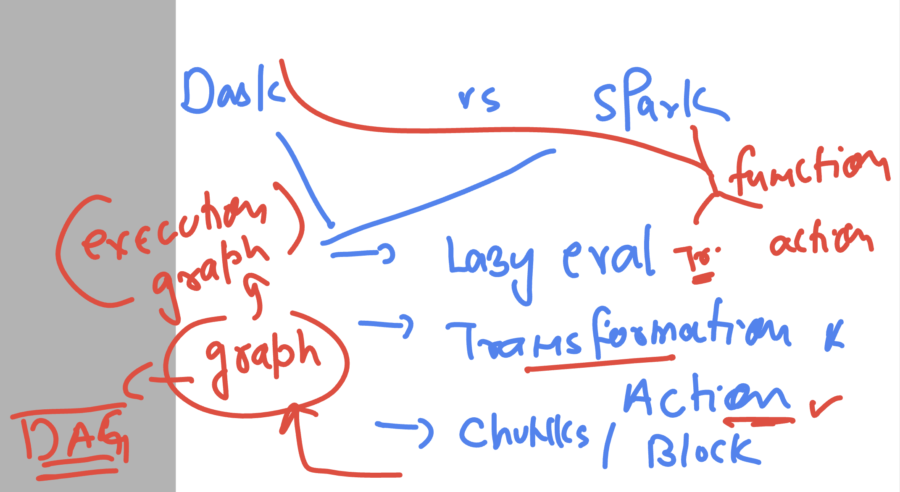
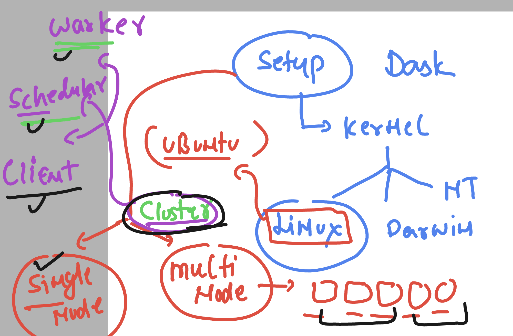
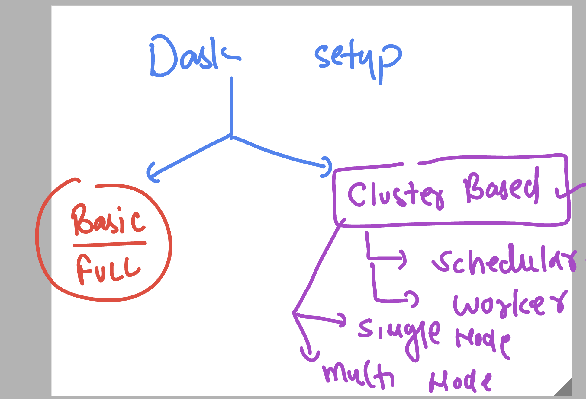
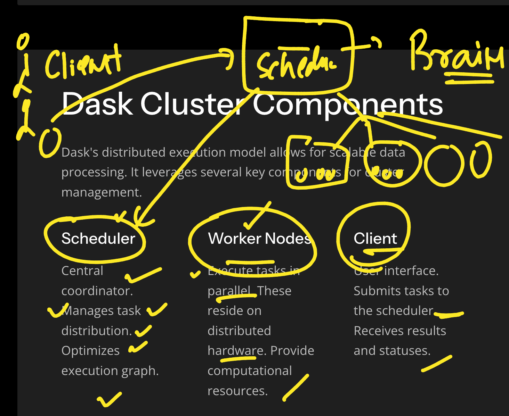
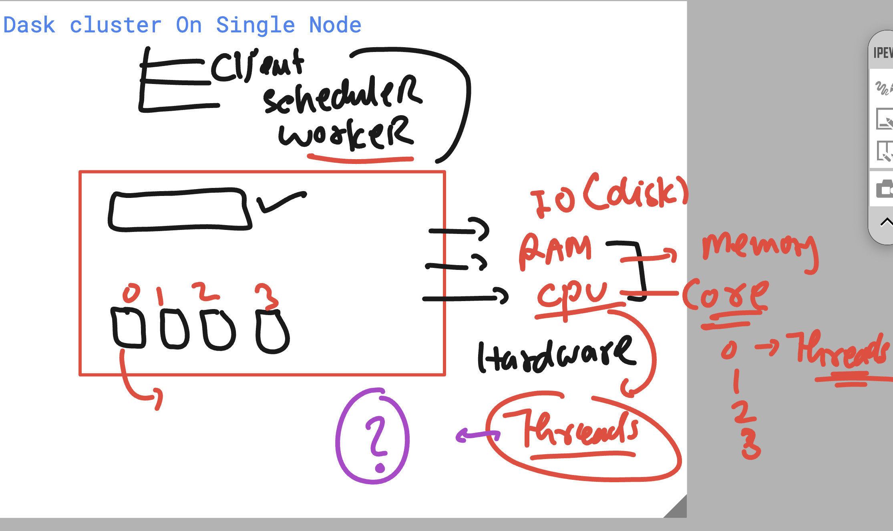

## Revision 



### Dask like apache spark 



### Dask setup 



### checking venv 

```
ubuntu@ip-172-31-24-249:~$ ls
Asarbanes-env        Yesildirek-env  blair-env    hailey1.ipynb              jupyterhub_cookie_secret  lewis1.ipynb     putman-env
Blair1.ipynb         andrew-env      clpp-env     jleroy-env                 kfaunce-env               mk_env           putman1.ipynb
Partridge-env        andrew.ipynb    clpp1.ipynb  jleroy1.ipynb              kfaunce1.ipynb            pnorton-env      quinn-env
Partridge_np1.ipynb  asarb1.ipynb    dave-env     jupyterhub.sqlite          kschipke-env              pnorton_1.ipynb  yesildirek-env
Staub-env            ashu-env        dave.ipynb   jupyterhub_config.py       kschipke1.ipynb           poe-env          yesildirek.ipynb
Untitled.ipynb       ashunp1.ipynb   hailey-env   jupyterhub_config.py.back  lewis-env                 poe1.ipynb
ubuntu@ip-172-31-24-249:~$ source ashu-env/bin/activate
(ashu-env) ubuntu@ip-172-31-24-249:~$ pip list  | grep numpy 
numpy                     2.2.4
(ashu-env) ubuntu@ip-172-31-24-249:~$ pip list  | grep  dask 
dask                      2025.2.0
(ashu-env) ubuntu@ip-172-31-24-249:~$ 

```

### Dask setup options 



### Dask cluster components 



### Dask cluster on Single Node 



### setup Dask local cluster (single node ) in Ubuntu 

```
sudo apt update
sudo apt install python3-venv 

===>
ubuntu@ip-172-31-16-49:~$ python3 -m venv  ashu-env

ubuntu@ip-172-31-16-49:~$ ls
ashu-env

ubuntu@ip-172-31-16-49:~$ source ashu-env/bin/activate
(ashu-env) ubuntu@ip-172-31-16-49:~$ 
(ashu-env) ubuntu@ip-172-31-16-49:~$ 

pip install dask dask[complete] distributed 
```