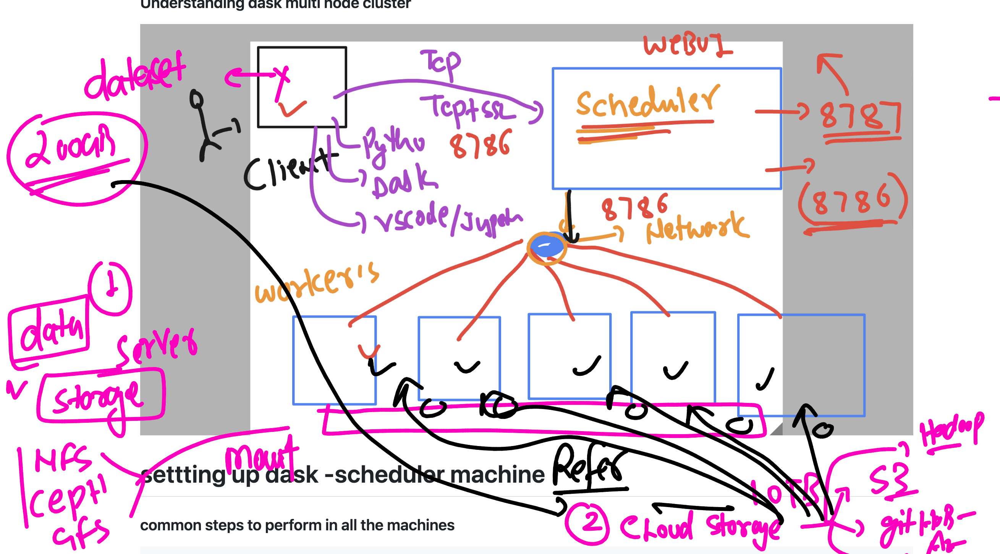

## Revision 


### Dask like apache spark 


### Dask setup 


### checking venv 

```
ubuntu@ip-172-31-24-249:~$ ls
Asarbanes-env        Yesildirek-env  blair-env    hailey1.ipynb              jupyterhub_cookie_secret  lewis1.ipynb     putman-env
Blair1.ipynb         andrew-env      clpp-env     jleroy-env                 kfaunce-env               mk_env           putman1.ipynb
Partridge-env        andrew.ipynb    clpp1.ipynb  jleroy1.ipynb              kfaunce1.ipynb            pnorton-env      quinn-env
Partridge_np1.ipynb  asarb1.ipynb    dave-env     jupyterhub.sqlite          kschipke-env              pnorton_1.ipynb  yesildirek-env
Staub-env            ashu-env        dave.ipynb   jupyterhub_config.py       kschipke1.ipynb           poe-env          yesildirek.ipynb
Untitled.ipynb       ashunp1.ipynb   hailey-env   jupyterhub_config.py.back  lewis-env                 poe1.ipynb
ubuntu@ip-172-31-24-249:~$ source ashu-env/bin/activate
(ashu-env) ubuntu@ip-172-31-24-249:~$ pip list  | grep numpy 
numpy                     2.2.4
(ashu-env) ubuntu@ip-172-31-24-249:~$ pip list  | grep  dask 
dask                      2025.2.0
(ashu-env) ubuntu@ip-172-31-24-249:~$ 

```

### Dask setup options 


### Dask cluster components 


### Dask cluster on Single Node 


### setup Dask local cluster (single node ) in Ubuntu 

```
sudo apt update
sudo apt install python3-venv 

===>
ubuntu@ip-172-31-16-49:~$ python3 -m venv  ashu-env

ubuntu@ip-172-31-16-49:~$ ls
ashu-env

ubuntu@ip-172-31-16-49:~$ source ashu-env/bin/activate
(ashu-env) ubuntu@ip-172-31-16-49:~$ 
(ashu-env) ubuntu@ip-172-31-16-49:~$ 

pip install dask dask[complete] distributed 
```

### setup dask single node cluster using given methods 


### using python3 to load localCluster of Dask 

```
ashu-env) ubuntu@ip-172-31-16-49:~$ python3
Python 3.12.3 (main, Feb  4 2025, 14:48:35) [GCC 13.3.0] on linux
Type "help", "copyright", "credits" or "license" for more information.
>>> 
>>> import dask 
>>> dir(dask)
['__builtins__', '__cached__', '__doc__', '__file__', '__git_revision__', '__loader__', '__name__', '__package__', '__path__', '__spec__', '__version__', '_compatibility', '_task_spec', '_version', 'annotate', 'annotations', 'base', 'callbacks', 'compute', 'config', 'context', 'core', 'datasets', 'delayed', 'get', 'get_annotations', 'hashing', 'highlevelgraph', 'is_dask_collection', 'istask', 'local', 'multiprocessing', 'optimization', 'optimize', 'order', 'persist', 'sizeof', 'system', 'threaded', 'tokenize', 'typing', 'utils', 'visualize', 'widgets']
>>> 
>>> 
>>> from dask.distributed  import LocalCluster 
>>> from dask.distributed  import Client 
>>> from dask.distributed  import LocalCluster,Client  
>>> 
# Creating cluster on single Node 
>>> cluster = LocalCluster() 
>>> 
>>> # connect cluster 
>>> ashu_connect = Client(cluster)
>>> dir(ashu_connect)
['_', '_Client__loop', '__aenter__', '__aexit__', '__annotations__', '__await__', '__class__', '__del__', '__delattr__', '__dict__', '__dir__', '__doc__', '__enter__', '__eq__', '__exit__', '__format__', '__ge__', '__getattribute__', '__getstate__', '__gt__', '__hash__', '__init__', '__init_subclass__', '__le__', '__lt__', '__module__', '__ne__', '__new__', '__reduce__', '__reduce_ex__', '__repr__', '__setattr__', '__sizeof__', '__str__', '__subclasshook__', '__weakref__', '_asynchronous', '_cancel', '_close', '_connecting_to_scheduler', '_dec_ref', '_default_event_handlers', '_deserializers', '_dump_cluster_state', '_ensure_connected', '_event_handlers', '_expand_key', '_gather', '_gather_future', '_gather_keys', '_gather_remote', '_gather_semaphore', '_get_components_from_future', '_get_computation_code', '

# getting cluster dashboard URL of Scheduler
>>> ashu_connect.dashboard_link
'http://127.0.0.1:8787/status'

```

### Running sample code with cluster create and use 

```
 wget https://raw.githubusercontent.com/redashu/usgs_dask_17thmarch2025/refs/heads/master/day2/cluster.py 

 === 
hu-env) ubuntu@ip-172-31-16-49:~$ ls
ashu-env  cluster.py

# view the code using cat 

(ashu-env) ubuntu@ip-172-31-16-49:~$ cat cluster.py 
from dask.distributed  import LocalCluster,Client  
import dask.array as da

# Creating local cluster
cluster = LocalCluster()
# Creating client
client = Client(cluster)
# Displaying client dashboard
print(client.dashboard_link)
# using dask array to create array of 1000 elements
arr1 = da.ones((1000,1000),chunks=(100,100))
# performing sum , mean of array elements using dask array
# these oparation transformation in dask array
result1 = arr1.sum()
result2 = arr1.mean()
# using action call to get the result -- compute
# this will trigger the computation
print(result1.compute())
print(result2.compute())

# shutdown cluster
client.shutdown()

```

### multi node dask cluter setup options 


### Understanding dask multi node cluster 


# settting up dask -scheduler machine 

### common steps to perform in all the machines 

```
 1  sudo apt update
    2  sudo apt install python3-venv -y
    3  history 
    4  python3 -m venv dask-scheduler-env 
    5  ls
    6  source dask-scheduler-env/bin/activate
    7  pip install dask dask[complete] distributed
```

### starting scheduler process 
```
dask-scheduler
```

### above method temp so making start up script 

```
sudo vim /etc/systemd/system/dask-scheduler.service

[Unit]
Description=Dask Scheduler
After=network.target


[Service]
User=ubuntu
WorkingDirectory=/home/ubuntu
ExecStart=/home/ubuntu/dask-scheduler-env/bin/dask-scheduler
Restart=always
RestartSec=5


[Install]
WantedBy=multi-user.target

```

### starting schduler service 

```
 sudo systemctl daemon-reload 
 sudo systemctl start dask-scheduler # for starting 
 sudo systemctl status dask-scheduler # checking status 
 sudo systemctl enable dask-scheduler # making it auto start on system start
```


### starting and setting up worker dask-worker 

```

sudo apt update
    2  sudo apt install python3-venv -y
    3  history 
    4  python3 -m venv dask-scheduler-env 
    5  ls
    6  source dask-scheduler-env/bin/activate
    7  pip install dask dask[complete] distributed

ashu-env) ubuntu@ip-172-31-16-49:~$ sudo -i
root@ip-172-31-16-49:~# whoami
root
root@ip-172-31-16-49:~# cd /etc/systemd/system
 wget https://raw.githubusercontent.com/redashu/usgs_dask_17thmarch2025/refs/heads/master/day2/dask-worker.service

  sudo systemctl daemon-reload 

  sudo systemctl start dask-worker
  sudo systemctl status dask-worker
   sudo systemctl enable dask-worker

```


### Reading data from external source to process in dask cluster 
 


