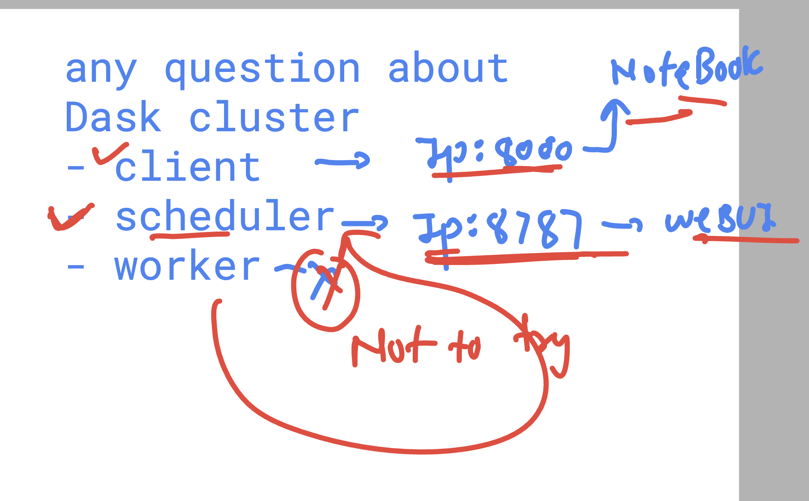

### Dask parallel computing understanding 


### data handle in dask -- array , dataframe , BAG 


### few info about dask cluster and client


### checking worker status 

```
sudo systemctl status dask-worker
● dask-worker.service - Dask Scheduler
     Loaded: loaded (/etc/systemd/system/dask-worker.service; enabled; preset: enabled)
     Active: active (running) since Wed 2025-03-19 15:51:59 UTC; 6min ago
   Main PID: 529 (dask-worker)
      Tasks: 12 (limit: 4674)
     Memory: 234.2M (peak: 234.7M)
        CPU: 15.031s
     CGroup: /system.slice/dask-worker.service
             ├─529 /home/ubuntu/ashu-env/bin/python3 /home/ubuntu/ashu-env/bin/dask-worker tcp://172.31.31.30:8786
             ├─838 /home/ubuntu/ashu-env/bin/python3 -c "from multiprocessing.resource_tracker import main;main(10)"
             └─842 /home/ubuntu/ashu-env/bin/python3 -c "from multiprocessing.spawn import spawn_main; spawn_main(tracker_fd=11, pipe_handle=17)" --multiproc>

```

### checking port and service in dask cluster 



### Doing dataframe with github based dataset using dask cluster 


### some example of  data analysis with sales 

