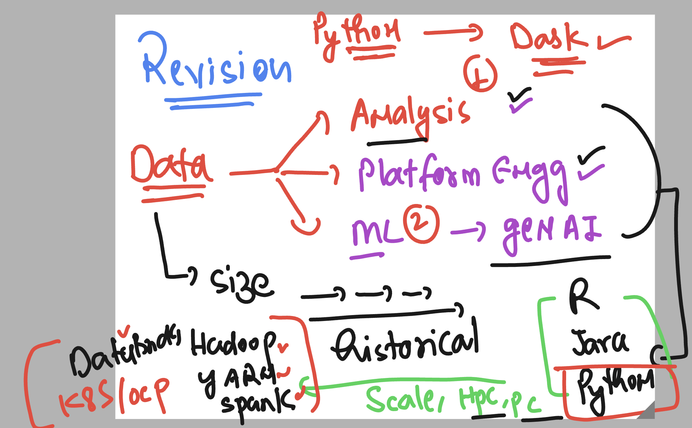
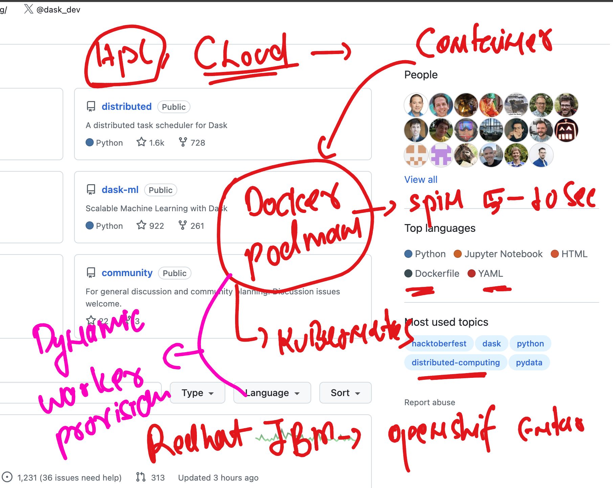
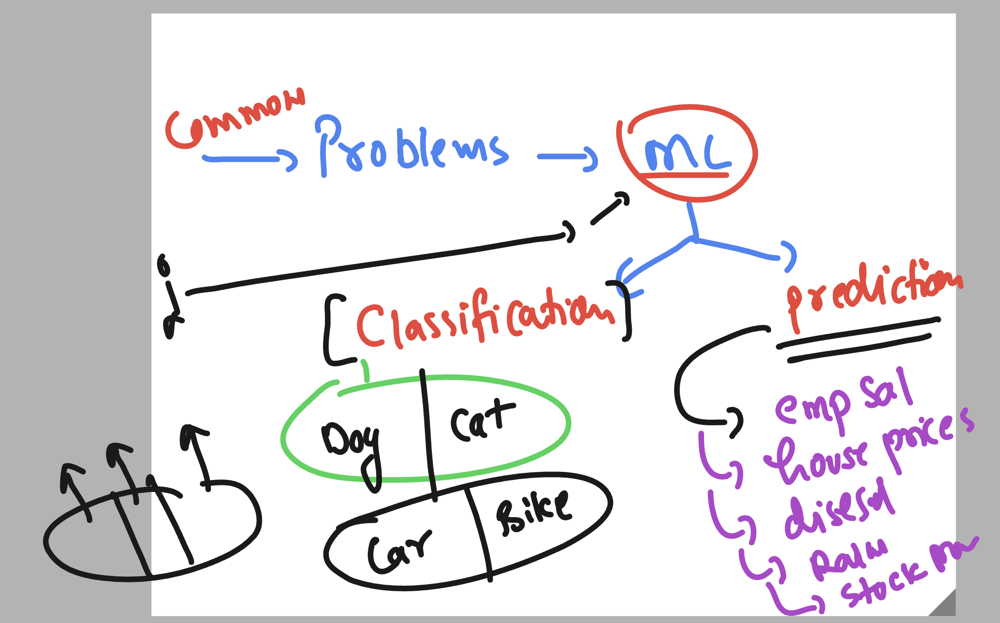
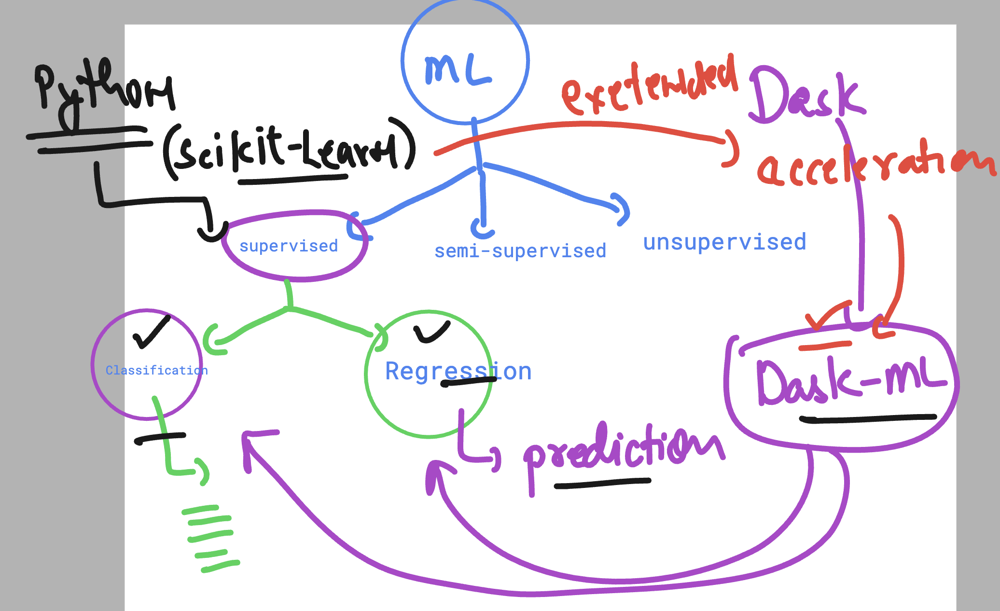
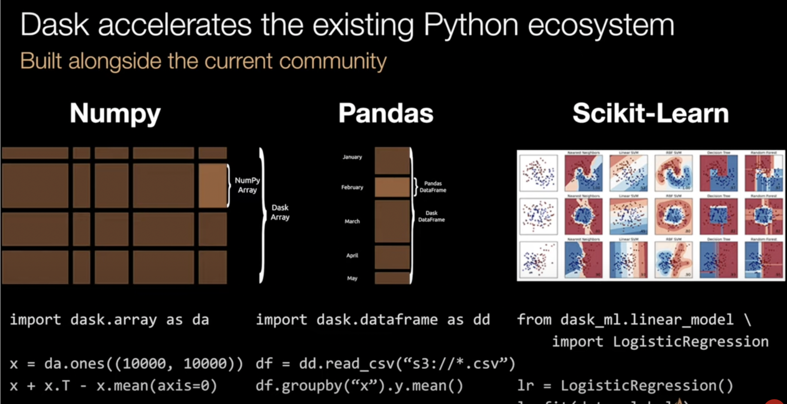
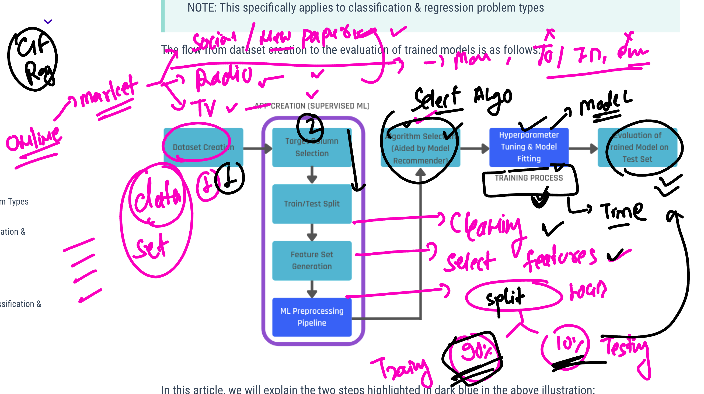
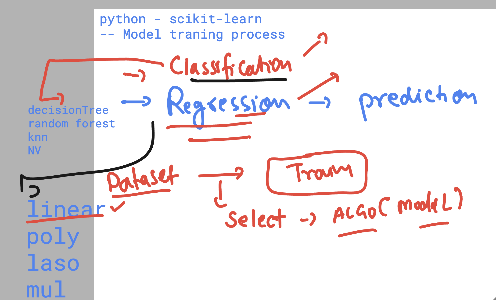
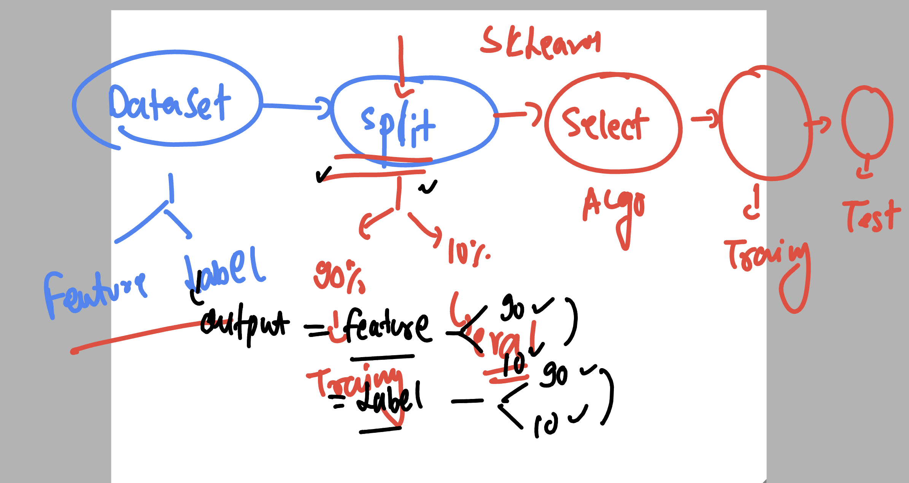

# revision 1 



### Dask with  container support 



## Machine learning common problem solving things 



### Dask-ML is an extension of python ML framework called scikit-learn



### Dask from python extension 



### machine learning model training process understanding 



### Regression and classification are having many ALgo / model 



### Implement Linear regression using python 

### Install scikit-learn in client machine 

```
(ashu-env) ubuntu@ip-172-31-24-249:~$ pip install scikit-learn 
Collecting scikit-learn
  Using cached scikit_learn-1.6.1-cp312-cp312-manylinux_2_17_x86_64.manylinux2014_x86_64.whl.metadata (18 kB)
Requirement already satisfied: numpy>=1.19.5 in ./ashu-env/lib/python3.12/site-packages (from scikit-learn) (2.1.3)
Requirement already satisfied: scipy>=1.6.0 in ./ashu-env/lib/python3.12/site-packages (from scikit-learn) (1.15.2)
Requirement already satisfied: joblib>=1.2.0 in ./ashu-env/lib/python3.12/site-packages (from scikit-learn) (1.4.2)
Collecting threadpoolctl>=3.1.0 (from scikit-learn)
  Using cached threadpoolctl-3.6.0-py3-none-any.whl.metadata (13 kB)
Using cached scikit_learn-1.6.1-cp312-cp312-manylinux_2_17_x86_64.manylinux2014_x86_64.whl (13.1 MB)
Using cached threadpoolctl-3.6.0-py3-none-any.whl (18 kB)
Installing collected packages: threadpoolctl, scikit-learn
Successfully installed scikit-learn-1.6.1 threadpoolctl-3.6.0

```


### Model training process 



